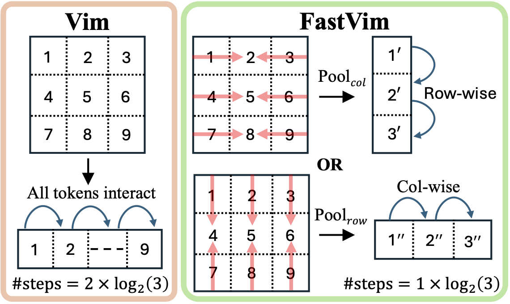
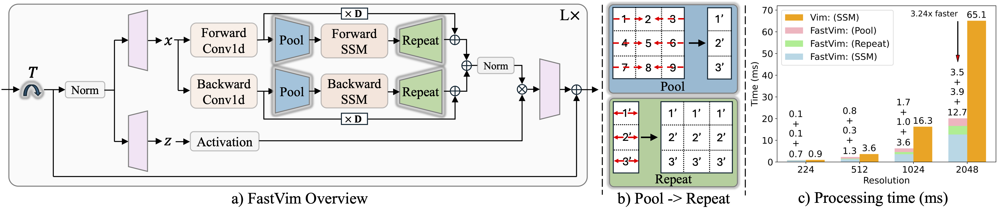

<div align="center">
<h1>Fast Vision Mamba </h1>
<h3>Pooling Spatial Dimensions for Accelerated Processing</h3>

[Saarthak Kapse](https://saarthak-kapse.github.io/)<sup>1,2</sup>\*, [Robin Betz](https://www.robinbetz.com/)<sup>1</sup>, [Srinivasan Sivanandan](https://srinivasans.github.io/)<sup>1</sup>

<sup>1</sup>  Insitro, <sup>2</sup>  Stony Brook University

(\*) Work completed during internship at Insitro.

</div>


## Abstract
State Space Models (SSMs) with selective scan (Mamba) have been adapted into efficient vision models. Mamba, unlike Vision Transformers, achieves linear complexity for token interactions through a recurrent hidden state process. This sequential processing is enhanced by a parallel scan algorithm, which reduces the computational time of recurrent steps from $L$ sequential steps to $log(L)$ parallel steps with respect to the number of input tokens ($L$). In this work, we propose Fast Vision Mamba (FastVim), that further reduces the computational time of the SSM block by reducing the number of recurrent steps in Vision Mamba models while still retaining model performance. By alternately pooling tokens along image dimensions across Mamba blocks, we obtain a 2x reduction in the number of parallel steps in SSM block. Our model offers up to $72.5$% speedup in inference speed compared to baseline Vision Mamba models on high resolution (2048x2048) images. Our experiments demonstrate state-of-the-art performance with dramatically improved throughput in a range of tasks such as image classification, cell perturbation prediction, segmentation, and object detection.


<div align="left">
    
</div>

## Overview
<div align="center">

</div>

## Environment setup

- Python 3.11.9
```
  conda create -n fastvim -c conda-forge python=3.11.9 gcc=11.4 gxx=11.4
  conda activate fastvim
```

- torch 2.1.1 + cu12.1, and other requirements.
```
pip install -r requirements.txt
```

- Install ``causal_conv1d`` and ``mamba``

```
pip install causal-conv1d==1.1.3.post1
pip install -e mamba-1p1p1
```

- Install ``fastvim_kernel``
```
cd fastvim_kernel
pip install -e mamba-1p1p1
```

## Experiments

### 1) Image Classification - ImageNet-1k

Edit the values of `imagenet_train_dir_path` and `imagenet_val_dir_path` in `imagenet_classification/datasets_supervised.py`
to locations of the training and validation datasets, respectively.

Then, run FastVim-T network for supervised training from scratch on a single GPU for 300 epochs with the following command.
```
PYTHONPATH="$PWD" python imagenet_classification/train.py --config_name "FastVimT.yaml" --model_save_dir "checkpoints_supervised_IN1k/"
```

More instruction regarding config and log files, model weights, and training/testing code can be found in [SUPERVISED.md](imagenet_classification/README.md)

### 2) Self-Supervised Learning: MAE - ImageNet-1k
Set the value of `imagenet_train_dir_path` in `mae/datasets_mae.py` to the location of the training dataset.

Run FastMaskVim-B network for pretraining on a single GPU for 1600 epochs with the following command.
```
PYTHONPATH="$PWD" python mae/pretrain.py --config_name "pretrain_FastVimB.yaml" --model_save_dir "checkpoints_mae_pretrain_IN1k/"
```

Edit the value of `pretrained_checkpoint_path` in `mae/config/finetune_FastVimB.yaml` to point to the pretrained
checkpoint, and set the values of `imagenet_train_dir_path` and `imagenet_val_dir_path` in `mae/dataset_finetune.py`
to locations of the training and validation datasets, respectively.

Then, run FastVim-B network for finetuning on a single GPU for 100 epochs with the following command:
```
PYTHONPATH="$PWD" python mae/finetune.py --config_name "finetune_FastVimB.yaml" --model_save_dir "checkpoints_mae_finetune_IN1k/"
```
More instruction regarding pretraining, finetuning, and linear probing can be found in [MAE.md](mae/README.md)

### 3) Cell Imaging Classification  - JUMP-CP

Run FastChannelVim-S/16 network for supervised training from scratch on a single GPU for 100 epochs with the following command.
```
PYTHONPATH="$PWD" python cell_imaging/train.py --config_name "FastChannelVimS.yaml" --model_save_dir "checkpoints_supervised_cellimaging/"
```
More instruction regarding config files, model weights, and training code can be found in [CHANNEL.md](cell_imaging/README.md)

### 4) Semantic Segmentation - ADE20K

Instruction is in [SEGMENTATION.md](segmentation/README.md)

### 5) Object Detection and Instance Segmentation - MSCOCO 2017

Instruction is in [DETECTION.md](detection/README.md)


## Acknowledgement:
This project is based on Mamba ([paper](https://arxiv.org/abs/2312.00752), [code](https://github.com/state-spaces/mamba)), Causal-Conv1d ([code](https://github.com/Dao-AILab/causal-conv1d)), Vision Mamba ([paper](https://arxiv.org/abs/2401.09417), [code](https://github.com/hustvl/Vim/tree/main)), ChannelViT ([paper](https://arxiv.org/abs/2309.16108), [code](https://github.com/insitro/ChannelViT)), Masked Autoencoders ([paper](https://arxiv.org/abs/2111.06377), [code](https://github.com/facebookresearch/mae/tree/main)), DeiT ([paper](https://arxiv.org/abs/2012.12877), [code](https://github.com/facebookresearch/deit)). Thanks for their wonderful works.

## Citation
If you find FastVim is useful in your research or applications, please consider giving us a star 🌟 and citing it by the following BibTeX entry.

```bibtex
@inproceedings{FastVim,
  title={Fast Vision Mamba: Pooling Spatial Dimensions for Accelerated Processing},
  author={Kapse, Saarthak and Betz, Robin and Sivanandan, Srinivasan},
}
```
