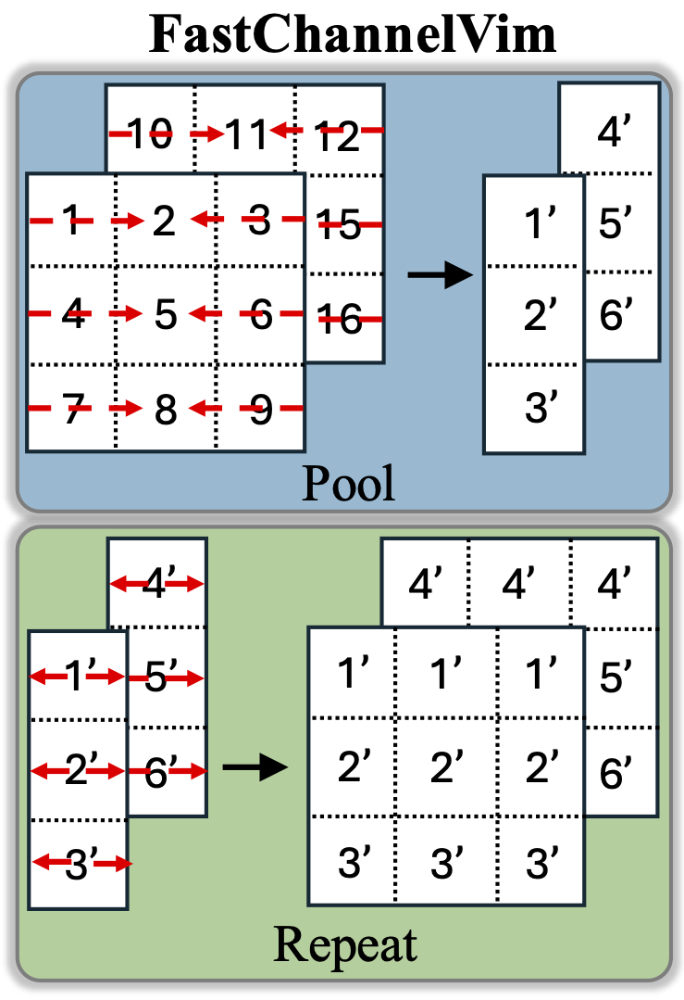

    

## Model Weights and Configurations

| Model | Token Grid | Top-1 Acc. | Config |
|:------------------------------------------------------------------:|:-------------:|:----------:|:----------:|
|[FastChannelVim-S/16.ckpt](https://github.com/insitro/FastVim/releases/download/v0/FastChannelVim_small.ckpt)    |       142 x 8       |   73.6   | [FastChannelVim-S/16.yaml](config/FastChannelVimS.yaml) |
|[FastChannelVim-S/16 - Maxpool.ckpt](https://github.com/insitro/FastVim/releases/download/v0/FastChannelVim_small_maxpool.ckpt)    |       142 x 8       |   72.9   | [FastChannelVim-S/16 - Maxpool.yaml](config/FastChannelVimS_maxpool.yaml) |
|[ChannelVim-S/16.ckpt](https://github.com/insitro/FastVim/releases/download/v0/ChannelVim_small.ckpt)    |       142 x 8       |   73.5   | [ChannelVim-S/16.yaml](config/ChannelVimS.yaml) |
|[FastChannelVim-S/8.ckpt](https://github.com/insitro/FastVim/releases/download/v0/FastChannelVim_small_ps8.ckpt)    |       282 x 8       |   83.1   | [FastChannelVim-S/8.yaml](config/FastChannelVimS_ps8.yaml) |
|[FastChannelVim-S/8 - Maxpool.ckpt](https://github.com/insitro/FastVim/releases/download/v0/FastChannelVim_small_maxpool_ps8.ckpt)    |       282 x 8       |   85.0   | [FastChannelVim-S/8 - Maxpool.yaml](config/FastChannelVimS_maxpool_ps8.yaml) |
|[ChannelVim-S/8.ckpt](https://github.com/insitro/FastVim/releases/download/v0/ChannelVim_small_ps8.ckpt)    |       282 x 8       |   83.0   | [ChannelVim-S/8.yaml](config/ChannelVimS_ps8.yaml) |

**Notes:**
- For reproducibility, make sure overall batch size remains 256 across GPUs/Nodes.
- The preprocessed JUMP-CP data used in this paper was previously released along with "Contextual Vision Transformers for Robust Representation Learning" [insitro/ContextViT](https://github.com/insitro/ContextViT).
