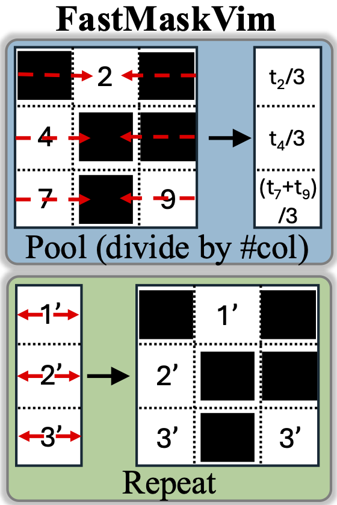

    

## Pretrained Model Weights and Configurations

| Model | Config | Log |
|:------------------------------------------------------------------:|:----------:|:----------:|
| [FastMaskVim-B.ckpt](https://github.com/insitro/FastVim/releases/download/v0/FastMaskVim_base.ckpt)    | [FastMaskVim-B.yaml](config/pretrain_FastVimB.yaml) | [FastMaskVim-B.csv](log/pretrain_FastVim_base_train_loss_IN1k_mae.csv) |
| [FastMaskVim-L.ckpt](path/to/model)    | [FastMaskVim-L.yaml](config/pretrain_FastVimL.yaml) | [FastMaskVim-L.csv](log/pretrain_FastVim_large_train_loss_IN1k_mae.csv) |
| [FastMaskVim-H.ckpt](path/to/model)    | [FastMaskVim-H.yaml](config/pretrain_FastVimH.yaml) | [FastMaskVim-H.csv](log/pretrain_FastVim_huge_train_loss_IN1k_mae.csv) |
| [Vim-B.ckpt](https://github.com/insitro/FastVim/releases/download/v0/pretrain_Vim_base.ckpt)    | [Vim-B.yaml](config/pretrain_VimB.yaml) | [Vim-B.csv](log/pretrain_Vim_base_train_loss_IN1k_mae.csv) |
| [Vim-L.ckpt](path/to/model)    | [Vim-L.yaml](config/pretrain_VimL.yaml) | [Vim-L.csv](log/pretrain_Vim_large_train_loss_IN1k_mae.csv) |

**Notes:**
- For reproducibility, make sure overall batch size remains 4096 across GPUs/Nodes. Flag `accum_iter` can be used.
- trainer/global_step in log files refers to gradient steps with batch size 4096.
- Modify `imagenet_train_dir_path` flag in [datasets_mae.py](datasets_mae.py).

## Finetuned Model Weights and Configurations

| Model  | Top-1 Acc. | Config | Log |
|:------------------------------------------------------------------:|:-------------:|:----------:|:----------:|
| [FastVim-B.ckpt](https://github.com/insitro/FastVim/releases/download/v0/finetune_FastVim_base.ckpt)    |   83.0   | [FastVim-B.yaml](config/finetune_FastVimB.yaml) | [FastVim-B.csv](log/finetune_FastVim_base_val_acc_IN1k_mae.csv) |
| [FastVim-L.ckpt](path/to/fastvimlarge/model)    |   84.9  | [FastVim-L.yaml](config/finetune_FastVimL.yaml) | [FastVim-L.csv](log/finetune_FastVim_large_val_acc_IN1k_mae.csv) |
| [FastVim-H.ckpt](path/to/fastvimhuge/model)    |   86.1   | [FastVim-H.yaml](config/finetune_FastVimH.yaml) | [FastVim-H.csv](log/finetune_FastVim_huge_val_acc_IN1k_mae.csv) |
| [FastVim-H_488.ckpt](path/to/vimhuge_448/model)    |   86.7   | [FastVim-H_448.yaml](config/finetune_FastVimH_448.yaml) | [FastVim-H_448.csv](log/finetune_FastVim_huge_448_val_acc_IN1k_mae.csv) |
| [Vim-B.ckpt](https://github.com/insitro/FastVim/releases/download/v0/finetune_Vim_base.ckpt)    |   83.3  | [Vim-B.yaml](config/finetune_VimB.yaml) | [Vim-B.csv](log/finetune_Vim_base_val_acc_IN1k_mae.csv) |
| [Vim-L.ckpt](path/to/fastvimlarge/model)    |   85.1  | [Vim-L.yaml](config/finetune_VimL.yaml) | [Vim-L.csv](log/finetune_Vim_large_val_acc_IN1k_mae.csv) |

**Notes:**
- For reproducibility, make sure overall batch size remains 1024 across GPUs/Nodes. Flag `accum_iter` can be used.
- trainer/global_step in log files refers to gradient steps with batch size 1024.
- Modify `imagenet_train_dir_path` and `imagenet_val_dir_path` flags in [datasets_finetune.py](datasets_finetune.py).
